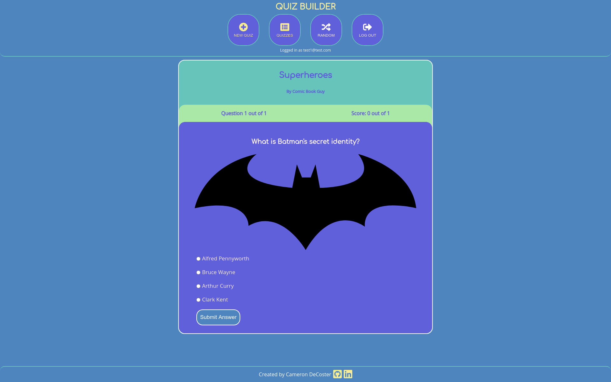

# [Quiz Builder API](https://quiz-builder-cdd.herokuapp.com)

This is the repo for the backend of [Quiz Builder](https://quiz-builder-client.vercel.app). Quiz Builder is an easy to use app to build quizzes which can be shared with your friends. The frontend communicates to the backend using the API:

-   **/api/auth**

    The auth endpoint is used to authenticate users during login. It accepts a POST request with a username and password.

-   **/api/quizzes, /api/quizzes/{id}**

    The quizzes endpoint is used to get information about the quizzes created by the user. It accepts GET and POST requests to the endpoint and will accept GET, UPDATE, and DELETE requests to the specific id.

-   **/api/questions, /api/questions/{id}**

    The questions endpoint is used to get questions for the quizzes created by the user. It accepts GET and POST requests to the endpoint and will accept GET, UPDATE, and DELETE requests to the specific id.

-   **/api/users**

    The users endpoint is used to register new users. It accepts a POST request with a username and password.

The API is located [here](https://quiz-builder-cdd.herokuapp.com).

[Quiz Builder](https://quiz-builder-client.vercel.app) is built using Node/Express/PostgreSQL for the backend and React for the [frontend](https://github.com/camdecoster/quiz-builder-client). Give it a try and let me know if you have any [feedback or suggestions](https://github.com/camdecoster/quiz-builder-api/issues) on the API.
